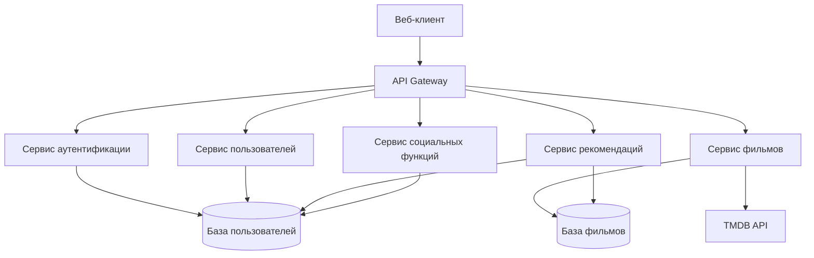
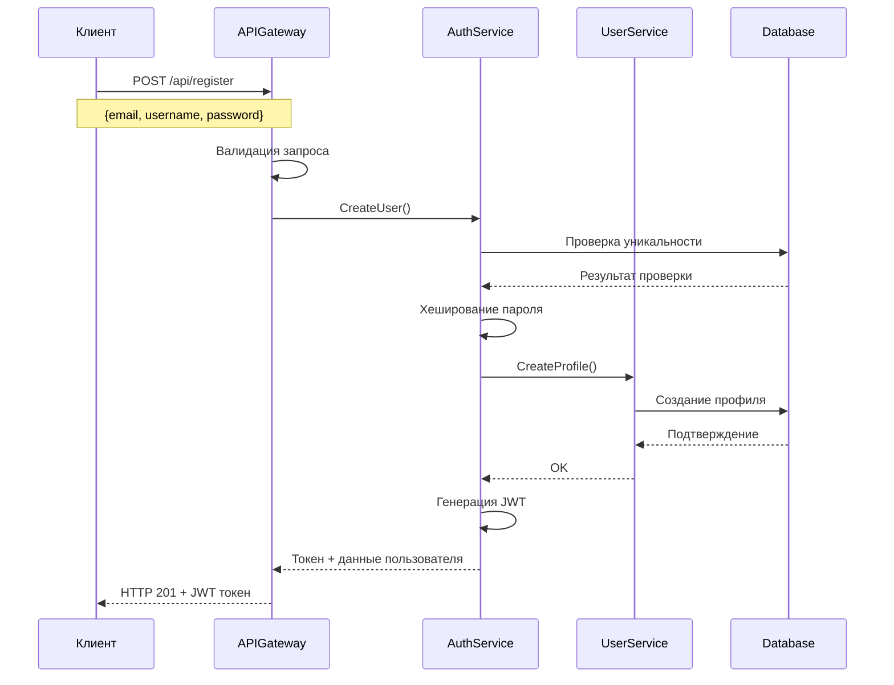
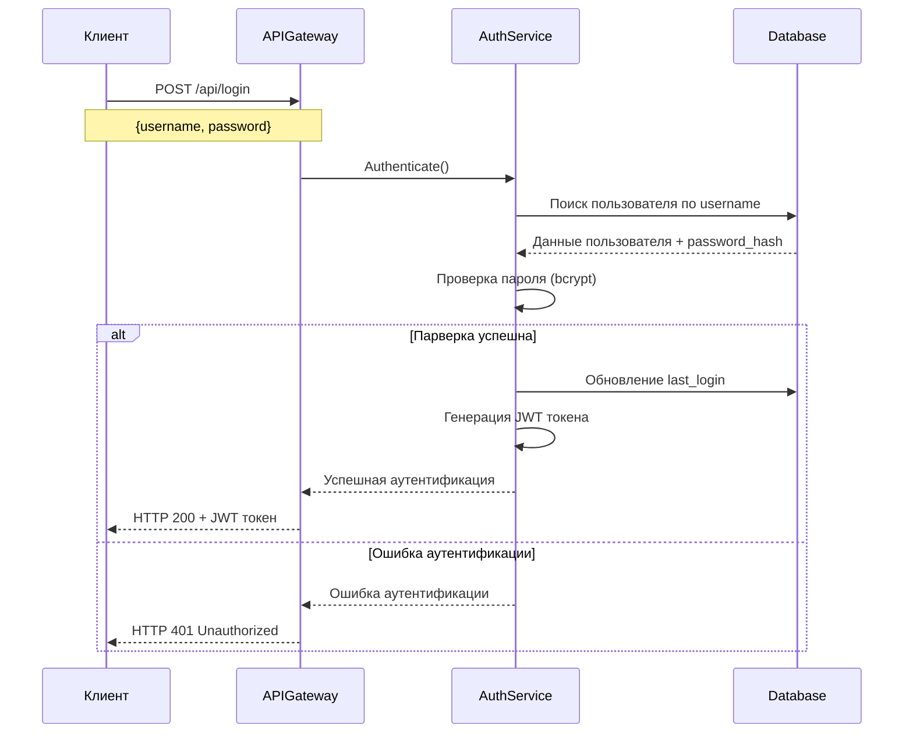
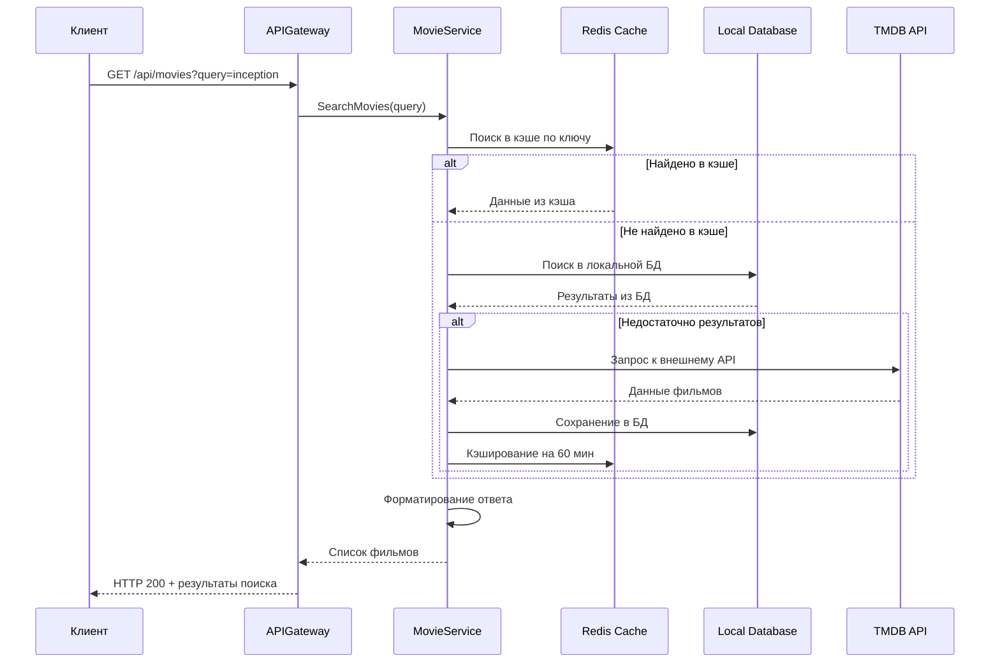
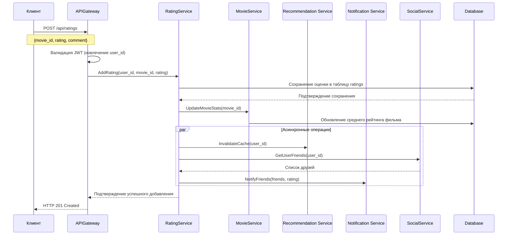
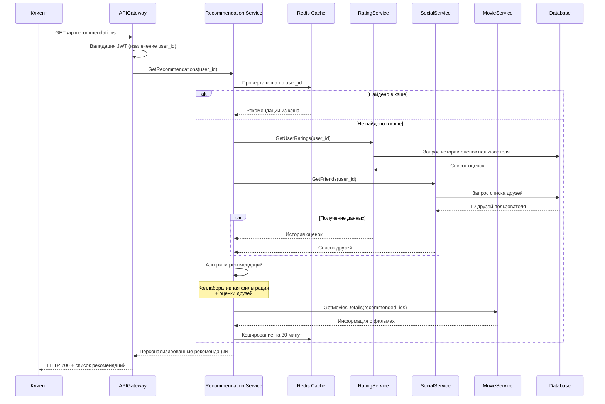
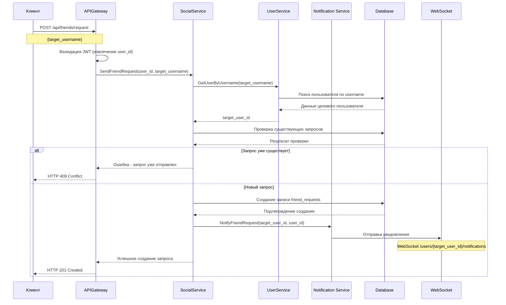

# Техническое решение проекта «FilmBuddy: Упрощенная система рекомендаций»

## Введение

**Цель проекта:**  
Создание работающего прототипа системы рекомендаций фильмов с базовыми социальными функциями, используя минимальный набор технологий.

**Основания для разработки:**  
Учебный проект по изучению систем рекомендаций и веб-разработки

**Команда:**
- Болдаков Владимир Евгеньевич - Team Lead/Backend Developer/DevOps Engineer
- Майоров Игорь Константинович - Backend/Analytics
- Демачева Маргарита - Backend

---

## Глоссарий

| Термин | Определение |
|--------|-------------|
| **Пользователь** | Физическое лицо, использующее систему для получения рекомендаций фильмов |
| **Зарегистрированный пользователь** | Пользователь, прошедший процедуру регистрации и имеющий учетную запись в системе |
| **Фильм** | Кинематографическое произведение, представленное в системе с набором атрибутов |
| **Оценка** | Пользовательская оценка фильма по заданной шкале (1-5 звезд) |
| **Рекомендация** | Предложенный системой фильм, который может понравиться пользователю |
| **Социальная лента** | Лента активности друзей: их оценки и отзывы о фильмах |
| **Друг** | Пользователь, добавленный в список контактов с взаимным подтверждением |
| **Профиль** | Публичная информация о пользователе: имя, аватар, список оцененных фильмов |
| **Запрос в друзья** | Приглашение одного пользователя другому для добавления в контакты |
| **Уведомление** | Оповещение пользователя о новом событии в системе |
| **Аутентификация** | Процесс проверки подлинности пользователя при входе в систему |
| **Система рекомендаций** | Алгоритм, который на основе пользовательских оценок выдает персональные рекомендации |

---

## Функциональные требования

Система должна предоставлять следующие функции:

# Функциональные требования системы рекомендаций фильмов

## 1. Регистрация и аутентификация пользователей

### 1.1. Регистрация нового пользователя
**ID:** `AUTH-001`

**Описание:**
- Система должна предоставлять форму регистрации с обязательными полями:
  - Email (уникальный)
  - Пароль (минимум 8 символов, включая цифры и буквы)
  - Имя пользователя (от 3 до 50 символов)
- Валидация введенных данных в реальном времени
- Подтверждение email через отправку кода активации
- Автоматический вход после успешной регистрации

**Бизнес-правила:**
- Один email может быть использован только для одной учетной записи
- Пароль хранится в хэшированном виде
- Учетная запись активируется только после подтверждения email

### 1.2. Аутентификация пользователя
**ID:** `AUTH-002`

**Описание:**
- Форма входа с email и паролем
- Возможность "Запомнить меня" (долгая сессия)
- Восстановление пароля через email
- JWT-токен для авторизации API-запросов

**Безопасность:**
- Блокировка после 5 неудачных попыток входа
- Сессия истекает через 24 часа (7 дней при "Запомнить меня")

## 2. Управление профилем пользователя

### 2.1. Просмотр и профиля
**ID:** `PROFILE-001`

**Описание:**
- Просмотр собственного профиля с:
  - Основной информацией (имя, email, дата регистрации)
  - Статистикой (количество оценок, друзей, просмотренных фильмов)

### 2.2. История активности
**ID:** `PROFILE-002`

**Описание:**
- Хронологическая лента собственных действий:
  - Поставленные оценки
  - Добавленные в "хочу посмотреть" фильмы
  - Добавленные друзья

## 3. Поиск и добавление в друзья

### 3.1. Поиск пользователей
**ID:** `SOCIAL-001`

**Описание:**
- Поиск по имени пользователя или email

### 3.2. Управление друзьями
**ID:** `SOCIAL-002`

**Описание:**
- Отправка/принятие/отклонение заявок в друзья
- Удаление из друзей
- Просмотр профиля друга

## 4. Поиск фильмов

### 4.1. Расширенный поиск фильмов
**ID:** `SEARCH-001`

**Параметры поиска:**
- По названию (частичное совпадение)
- По жанру (множественный выбор)
- По году выпуска (диапазон)
- По режиссеру
- По актерам
- По рейтингу (минимальный рейтинг IMDb/Kinopoisk)

## 5. Просмотр информации о фильме

### 5.1. Детальная страница фильма
**ID:** `MOVIE-001`

**Отображаемая информация:**
- Основные данные: название, постер, описание, год, страна
- Жанры, режиссер, актерский состав
- Рейтинги: IMDb, Kinopoisk, средний рейтинг пользователей системы
- Трейлер (embed YouTube/Vimeo)
- Продолжительность, бюджет, сборы

### 5.2. Социальные данные фильма
**ID:** `MOVIE-002

**Функциональность:**
- Количество пользователей, добавивших в "хочу посмотреть"
- Друзья, которые оценили этот фильм

## 6. Выставление оценок фильмам

### 6.1. Система оценок
**ID:** `RATING-001`

**Механизм оценки:**
- Звездная система от 1 до 5 (с шагом 0.5)
- Возможность изменить оценку
- Дата и время оценки
- Прикрепление краткого комментария к оценке (опционально)

### 6.2. Влияние оценок
**ID:** `RATING-002`

**Использование оценок:**
- Учет в алгоритме рекомендаций
- Влияние на общий рейтинг фильма
- Отображение в социальной ленте
- Формирование персональной статистики

## 7. Получение персональных рекомендаций

### 7.1. Алгоритмы рекомендаций
**ID:** `RECOMMEND-001`

**Типы рекомендаций:**
- **На основе коллаборативной фильтрации:** Похожие пользователи → их высокооцененные фильмы
- **Контентная фильтрация:** Фильмы с похожими характеристиками (жанр, режиссер, актеры)
- **Гибридная модель:** Комбинация нескольких алгоритмов
- **Социальные рекомендации:** На основе оценок друзей

### 7.2. Персонализация рекомендаций
**ID:** `RECOMMEND-002`

**Настройки:**
- Вес различных факторов в рекомендациях:
  - Жанровые предпочтения
  - Оценки друзей
  - Популярность
  - Новизна
- Возможность пометить рекомендацию как "не интересно"
- Обучение алгоритма на основе feedback

## 8. Уведомления о новых событиях

### 8.1. Система уведомлений
**ID:** `NOTIFY-001`

**Типы уведомлений:**
- **Социальные:** Запросы в друзья, принятые заявки, лайки на рецензии
- **Рекомендательные:** Новые персональные рекомендации
- **Системные:** Подтверждение email, сброс пароля

---

## Нефункциональные требования

- **Простота:** Минимальный набор технологий, простой интерфейс
- **Производительность:** Загрузка страниц < 2 секунд
- **Масштабируемость:** Возможность расширения функциональности
- **Доступность:** 99% uptime
- **Безопасность:** Шифрование паролей, защита от уязвимостей(XSS, SQL-иньекций)

---

## Пользовательские сценарии

### 1. Регистрация нового пользователя

**Предусловия:** Пользователь не зарегистрирован в системе

**Основной поток:**
1. Пользователь вводит email, логин и пароль
2. Система проверяет уникальность данных
3. Создается учетная запись и профиль пользователя
4. Пользователь получает доступ к системе

### 2. Поиск и добавление в друзья

**Предусловия:** Пользователь авторизован в системе

**Основной поток:**
1. Пользователь ищет другого пользователя по логину/email
2. Система возвращает результаты поиска
3. Пользователь отправляет запрос на добавление в друзья
4. Получатель уведомляется о запросе
5. Получатель принимает/отклоняет запрос
6. При принятии - пользователи добавляются в друзья

### 3. Поиск и оценка фильмов

**Предусловия:** Пользователь авторизован в системе

**Основной поток:**
1. Пользователь ищет фильм по названию/жанру/году
2. Система возвращает список фильмов
3. Пользователь выбирает фильм и просматривает его страницу
4. Пользователь выставляет оценку (1-5 звезд)
5. Система сохраняет оценку и обновляет рекомендации

### 4. Получение рекомендаций

**Предусловия:** Пользователь авторизован и оценил несколько фильмов

**Основной поток:**
1. Пользователь переходит на страницу рекомендаций
2. Система показывает список фильмов, которые могут понравиться пользователю
3. Рекомендации обновляются на основе новых оценок и активности друзей

---
## Архитектура системыы

---
# Технические сценарии FilmBuddy

## Сценарий 1: Регистрация пользователя

### Диаграмма последовательности

## Сценарий 2: Аутентификация пользователя

### Диаграмма последовательности

## Сценарий 3: Поиск фильмов

### Диаграмма последовательности

## Сценарий 4: Добавление оценки фильму

### Диаграмма последовательности

## Сценарий 5: Получение рекомендаций

### Диаграмма последовательности

## Сценарий 6: Добавление в друзья

### Диаграмма последовательности

---

## План разработки и тестирования

### Этап 1: Базовые микросервисы (Недели 1-2)
**Задачи:**
- Настройка API Gateway на Go
- Разработка Auth Service и User Service

**Тестирование:**
- Unit-тесты для каждого микросервиса
- Интеграционные тесты API Gateway
- Тестирование аутентификации

### Этап 2: Система оценок и рекомендаций (Недели 3-4)
**Задачи:**
- Разработка Rating Service и Recommendation Service
- Реализация алгоритма коллаборативной фильтрации
- Создание Movie Service с кэшированием

**Тестирование:**
- Тестирование алгоритма рекомендаций
- Проверка корректности оценок

### Этап 3: Социальные функции (Недели 5-6)
**Задачи:**
- Разработка Social Service и Notification Service
- Реализация системы друзей
- Интеграция WebSocket для уведомлений

**Тестирование:**
- End-to-end тестирование социальных сценариев
- Тестирование уведомлений в реальном времени
- Интеграционное тестирование всей системы

### Этап 4: Финальная интеграция и деплой (Неделя 7)
**Задачи:**
- Настройка межсервисной коммуникации
- Оптимизация производительности
- Деплой на хостинг
- Финальное тестирование

