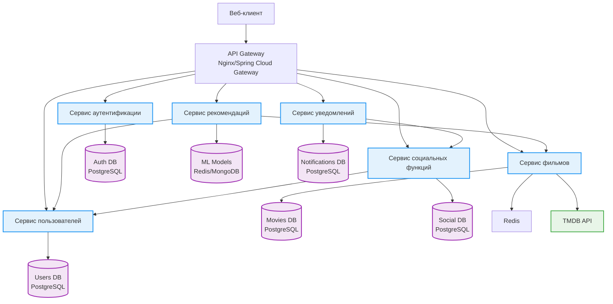
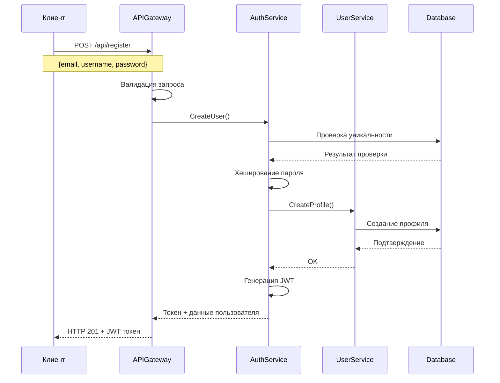
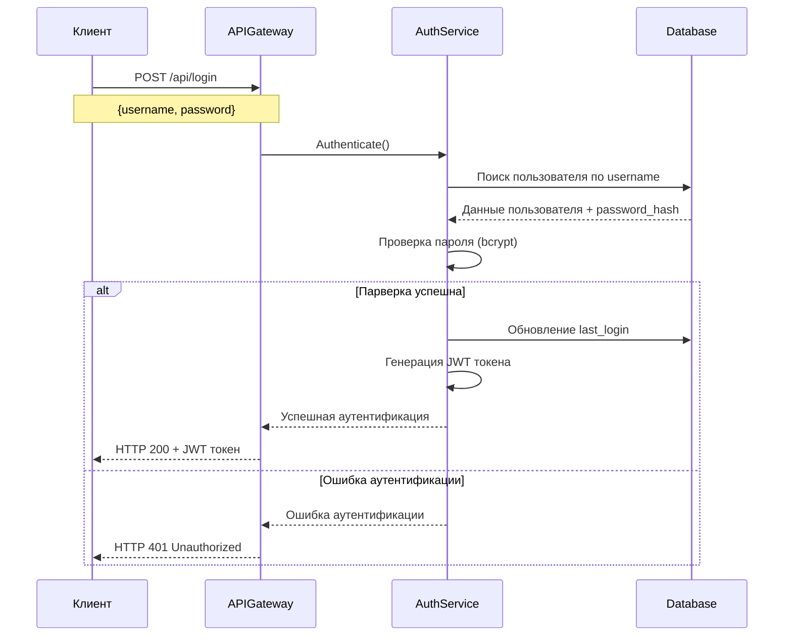
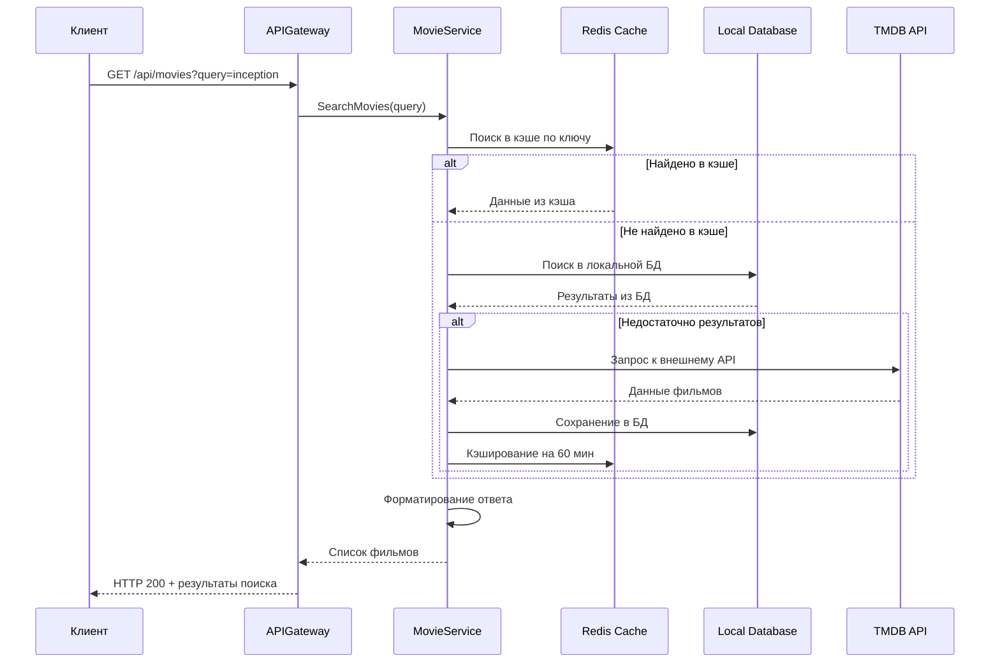
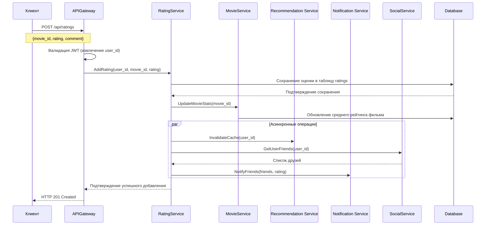
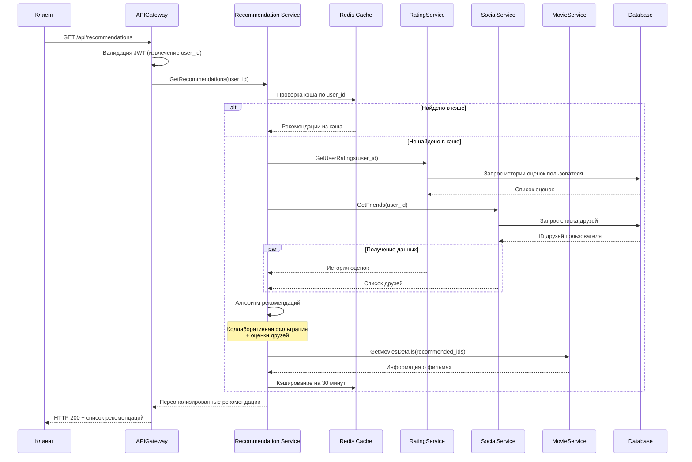
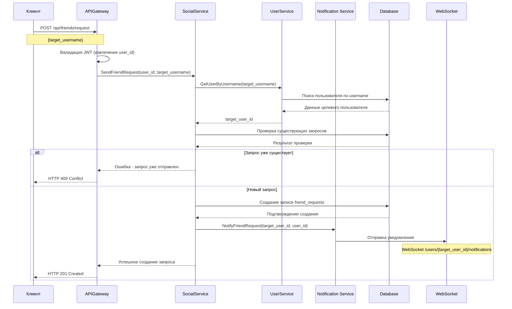
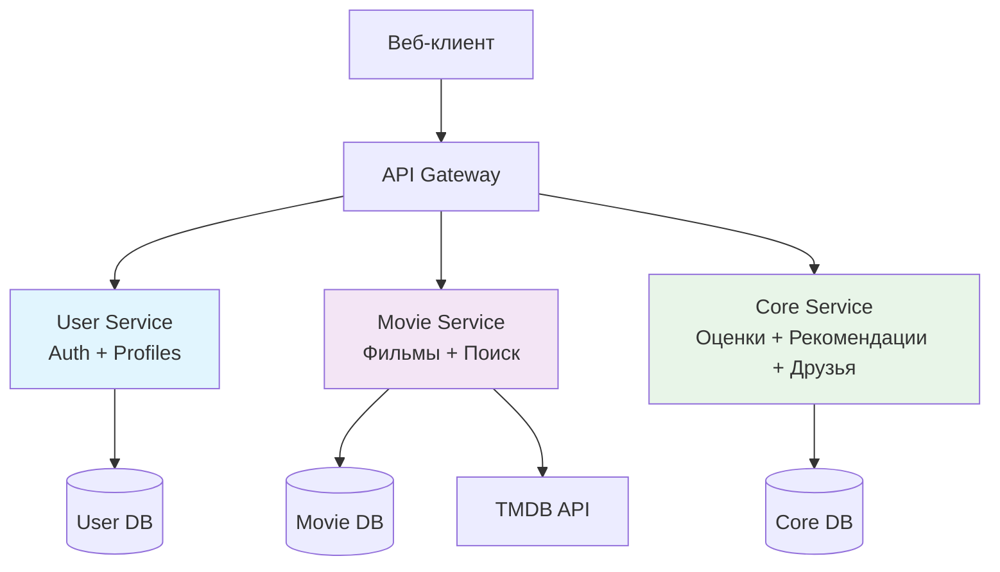

# Техническое решение проекта «FilmBuddy: Упрощенная система рекомендаций»

## Введение

**Цель проекта:**  
Создание работающего прототипа системы рекомендаций фильмов с базовыми социальными функциями, используя минимальный набор технологий.

**Основания для разработки:**  
Учебный проект по изучению систем рекомендаций и веб-разработки

**Команда:**
- Болдаков Владимир Евгеньевич - Backend Developer/DevOps Engineer
- Майоров Игорь Константинович - Backend/Analytics

---

## Глоссарий

| Термин | Определение |
|--------|-------------|
| **Пользователь** | Физическое лицо, использующее систему для получения рекомендаций фильмов |
| **Зарегистрированный пользователь** | Пользователь, прошедший процедуру регистрации и имеющий учетную запись в системе |
| **Фильм** | Кинематографическое произведение, представленное в системе с набором атрибутов |
| **Оценка** | Пользовательская оценка фильма по заданной шкале (1-5 звезд) |
| **Рекомендация** | Предложенный системой фильм, который может понравиться пользователю |
| **Социальная лента** | Лента активности друзей: их оценки и отзывы о фильмах |
| **Друг** | Пользователь, добавленный в список контактов с взаимным подтверждением |
| **Профиль** | Публичная информация о пользователе: имя, аватар, список оцененных фильмов |
| **Запрос в друзья** | Приглашение одного пользователя другому для добавления в контакты |
| **Уведомление** | Оповещение пользователя о новом событии в системе |
| **Аутентификация** | Процесс проверки подлинности пользователя при входе в систему |
| **Система рекомендаций** | Алгоритм, который на основе пользовательских оценок выдает персональные рекомендации |

---

# Функциональные требования системы рекомендаций фильмов

## 1. Регистрация и аутентификация пользователей
### 1.1. Регистрация нового пользователя

**Описание**:

Форма регистрации с обязательными полями:

Email (уникальный)

Пароль (минимум 6 символов)

Имя пользователя

Бизнес-правила:

Один email - одна учетная запись

Пароль хранится в хэшированном виде

Автоматическая активация учетной записи

### 1.2. Аутентификация пользователя
Описание:

Форма входа с email и паролем

JWT-токен для авторизации API-запросов

## 2. Управление профилем пользователя
### 2.1. Просмотр профиля

Описание:

Просмотр основной информации (имя, дата регистрации)

Базовая статистика (количество оценок, друзей)

## 3. Поиск и добавление в друзья
### 3.1. Поиск пользователей

Описание:

Поиск по имени пользователя

### 3.2. Управление друзьями

Описание:

Отправка/принятие заявок в друзья

Просмотр списка друзей

## 4. Поиск фильмов
### 4.1. Базовый поиск фильмов

Параметры поиска:

По названию

По жанру (один жанр)

## 5. Просмотр информации о фильме
### 5.1. Детальная страница фильма

Отображаемая информация:

Название, постер, описание, год

Жанры

Средний рейтинг пользователей системы

## 6. Выставление оценок фильмам
### 6.1. Система оценок

Механизм оценки:

Звездная система от 1 до 5

Возможность изменить оценку

### 6.2. Влияние оценок

Использование оценок:

Учет в алгоритме рекомендаций

Влияние на общий рейтинг фильма

## 7. Получение персональных рекомендаций
### 7.1. Алгоритмы рекомендаций

Типы рекомендаций:

На основе коллаборативной фильтрации

На основе жанровых предпочтений

### 7.2. Персонализация рекомендаций

Функциональность:

Ежедневное обновление рекомендаций

Возможность пометить рекомендацию как "не интересно"

---

## Нефункциональные требования

- **Простота:** Минимальный набор технологий, простой интерфейс
- **Масштабируемость:** Возможность расширения функциональности
- **Доступность:** 99% uptime
- **Безопасность:** хэширование паролей, защита от уязвимостей(XSS, SQL-иньекций)

---

## Пользовательские сценарии

### 1. Регистрация нового пользователя

**Предусловия:** Пользователь не зарегистрирован в системе

**Основной поток:**
1. Пользователь вводит email, логин и пароль
2. Система проверяет уникальность данных
3. Создается учетная запись и профиль пользователя
4. Пользователь получает доступ к системе

### 2. Поиск и добавление в друзья

**Предусловия:** Пользователь авторизован в системе

**Основной поток:**
1. Пользователь ищет другого пользователя по логину/email
2. Система возвращает результаты поиска
3. Пользователь отправляет запрос на добавление в друзья
4. Получатель уведомляется о запросе
5. Получатель принимает/отклоняет запрос
6. При принятии - пользователи добавляются в друзья

### 3. Поиск и оценка фильмов

**Предусловия:** Пользователь авторизован в системе

**Основной поток:**
1. Пользователь ищет фильм по названию/жанру/году
2. Система возвращает список фильмов
3. Пользователь выбирает фильм и просматривает его страницу
4. Пользователь выставляет оценку (1-5 звезд)
5. Система сохраняет оценку и обновляет рекомендации

### 4. Получение рекомендаций

**Предусловия:** Пользователь авторизован и оценил несколько фильмов

**Основной поток:**
1. Пользователь переходит на страницу рекомендаций
2. Система показывает список фильмов, которые могут понравиться пользователю
3. Рекомендации обновляются на основе новых оценок и активности друзей

---
## Архитектура системыы

# 🎬 Архитектура системы рекомендаций фильмов

## 📊 Общая схема архитектуры

# Подробное описание микросервисов

## Сервис аутентификации (Auth Service)

### Назначение
Централизованное управление доступом и безопасностью всей системы. Обеспечивает безопасную идентификацию и авторизацию пользователей.

### Основные функции
- **Регистрация новых пользователей** с валидацией данных
- **Аутентификация** по email/паролю
- **JWT токены** для управления сессиями
- **Восстановление пароля** через email
---

## Сервис пользователей (User Service)

### Назначение
Управление пользовательскими профилями, персональными данными и настройками системы.

### Основные функции
- **Создание и редактирование** профилей пользователей
- **Поиск пользователей** по различным критериям
---

## Сервис фильмов (Movie Service)

### Назначение
Централизованное управление каталогом фильмов, метаданными и поисковыми функциями.

### Основные функции
- **Полный каталог** фильмов с детальной информацией
- **Расширенный поиск** по названию, жанру, актерам, году
- **Интеграция с TMDB API** для автоматического обновления данных
- **Управление метаданными** (постеры, трейлеры, описания)
- **Система рейтингов** и отзывов
- **Рекомендации** на основе контента

---

## Сервис рекомендаций (Recommendation Service)

### Назначение
Интеллектуальная система генерации персонализированных рекомендаций на основе машинного обучения.

### Основные функции
- **Коллаборативная фильтрация** на основе поведения пользователей
- **Контентные рекомендации** по жанрам и характеристикам

---

## Сервис социальных функций (Social Service)

### Назначение
Управление социальными взаимодействиями между пользователями и создание комьюнити.

### Основные функции
- **Система друзей** (добавление, подтверждение, удаление)
- **Социальный граф** и связи между пользователями

---

## Сервис уведомлений (Notification Service)

### Назначение
Централизованная система управления и доставки уведомлений пользователям.

### Основные функции
- **In-app уведомления** в реальном времени
- **Email рассылки** по событиям системы
- **Push-уведомления** для мобильных устройств

---

## API Gateway

### Назначение
Единая точка входа для всех клиентских приложений, обеспечивающая маршрутизацию и безопасность.

### Основные функции
- **Интеллектуальная маршрутизация** запросов к микросервисам
- **Кэширование** часто запрашиваемых данных
- **Rate limiting** и защита от DDoS атак
- **Мониторинг** и логирование запросов
---

## Веб-клиент (Frontend)

### Назначение
Пользовательский интерфейс системы, обеспечивающий удобное взаимодействие со всеми функциями.

### Основные функции
- **Адаптивный дизайн** для всех устройств
- **Клиентский роутинг** и навигация

---
# Технические сценарии FilmBuddy

## Сценарий 1: Регистрация пользователя

### Диаграмма последовательности

### Цель
Создание новой учетной записи пользователя в системе с полной валидацией данных и автоматической аутентификацией после успешной регистрации.

#### Основной поток:
1. **Запрос регистрации** - Пользователь заполняет форму с email, username и password
2. **Валидация на Gateway** - Проверка формата данных и обязательных полей
3. **Проверка уникальности** - Auth Service проверяет, что email и username не заняты
4. **Безопасное хранение** - Пароль хешируется с использованием bcrypt
5. **Создание профиля** - User Service создает полный профиль пользователя
6. **Автоматический вход** - Генерация JWT токена для немедленного доступа

#### Требования безопасности:
- Сложность пароля: Минимум 8 символов, цифры и буквы
- Защита от ботов: CAPTCHA при множественных регистрациях
- HTTPS: Обязательное шифрование передачи данных

---

## Сценарий 2: Аутентификация пользователя

### Диаграмма последовательности

### Цель
Безопасная авторизация пользователя в системе с многоуровневой проверкой учетных данных и защитой от bruteforce-атак.

#### Основной поток:
1. **Запрос аутентификации** - Пользователь вводит username и password
2. **Поиск пользователя** - Auth Service ищет пользователя в базе данных по username
3. **Верификация пароля** - Сравнение хеша введенного пароля с хранимым хешем
4. **Обновление статистики** - Запись времени последнего входа
5. **Генерация токена** - Создание JWT токена с пользовательскими claims
6. **Возврат токена** - Клиент получает токен для последующих запросов

#### Альтернативный поток (неудачная аутентификация):
- Неверный username или password
- Учетная запись заблокирована из-за превышения попыток входа
- Учетная запись не подтверждена по email

---
## Сценарий 3: Поиск фильмов

### Диаграмма последовательности

### Цель
Эффективный поиск фильмов по различным критериям с использованием многоуровневого кэширования для максимальной производительности.

#### Основной поток:
1. **Поисковый запрос** - Пользователь вводит поисковый критерий
2. **Проверка кэша** - Поиск результатов в Redis кэше по хешу запроса
3. **Локальный поиск** - При отсутствии в кэше - поиск в локальной базе данных
4. **Внешний API запрос** - При недостатке результатов - обращение к TMDB API
5. **Сохранение данных** - Новые данные сохраняются в БД и кэше
6. **Форматирование ответа** - Подготовка данных для клиента

---
## Сценарий 4: Добавление оценки фильму

### Диаграмма последовательности

### Цель
Сохранение пользовательской оценки фильма с последующим обновлением всех зависимых систем и уведомлением заинтересованных сторон.

### Детальное описание

#### Основной поток:
1. **Добавление оценки** - Пользователь ставит оценку от 1 до 5 звезд
2. **Валидация запроса** - Проверка корректности оценки и существования фильма
3. **Сохранение оценки** - Запись в таблицу ratings с timestamp
4. **Обновление статистики** - Пересчет среднего рейтинга фильма
5. **Асинхронные операции** - Параллельное выполнение зависимых задач
6. **Подтверждение** - Возврат успешного статуса клиенту

#### Бизнес-правила:
- Один пользователь - одна оценка на фильм (с возможностью изменения)
- Минимальная оценка: 1 звезда, максимальная: 5 звезд
- Оценка влияет на персональные рекомендации
- Оценка учитывается в общем рейтинге фильма

---
## Сценарий 5: Получение рекомендаций

### Диаграмма последовательности

### Цель
Генерация персонализированных рекомендаций фильмов на основе комплексного анализа поведения пользователя и его социального окружения.

#### Основной поток:
1. **Запрос рекомендаций** - Пользователь запрашивает персональные рекомендации
2. **Проверка кэша** - Поиск готовых рекомендаций в Redis
3. **Сбор данных** - При отсутствии в кэше - сбор данных для алгоритма
4. **Запуск алгоритма** - Выполнение ML модели рекомендаций
5. **Обогащение данных** - Получение детальной информации о фильмах
6. **Кэширование результатов** - Сохранение рекомендаций на 30 минут

---
## Сценарий 6: Добавление в друзья

### Диаграмма последовательности

### Цель
Организация системы социальных связей между пользователями с управлением запросами на дружбу и реальными уведомлениями.

### Детальное описание

#### Основной поток:
1. **Запрос на дружбу** - Пользователь отправляет запрос другому пользователю
2. **Валидация запроса** - Проверка существования целевого пользователя
3. **Проверка ограничений** - Проверка на дублирование и существующие связи
4. **Создание запроса** - Запись в таблицу friend_requests со статусом "pending"
5. **Уведомление** - Отправка real-time уведомления целевому пользователю
6. **Подтверждение** - Возврат статуса успешного создания запроса

---

## План разработки и тестирования

### Этап 1: Базовые микросервисы (Недели 1-2)
**Задачи:**
- Настройка API Gateway на Go
- Разработка Auth Service и User Service

**Тестирование:**
- Unit-тесты для каждого микросервиса
- Интеграционные тесты API Gateway
- Тестирование аутентификации

### Этап 2: Система оценок и рекомендаций (Недели 3-4)
**Задачи:**
- Разработка Rating Service и Recommendation Service
- Реализация алгоритма коллаборативной фильтрации
- Создание Movie Service с кэшированием

**Тестирование:**
- Тестирование алгоритма рекомендаций
- Проверка корректности оценок

### Этап 3: Социальные функции (Недели 5-6)
**Задачи:**
- Разработка Social Service и Notification Service
- Реализация системы друзей
- Интеграция WebSocket для уведомлений

**Тестирование:**
- End-to-end тестирование социальных сценариев
- Тестирование уведомлений в реальном времени
- Интеграционное тестирование всей системы

### Этап 4: Финальная интеграция и деплой (Неделя 7)
**Задачи:**
- Настройка межсервисной коммуникации
- Оптимизация производительности
- Деплой на хостинг
- Финальное тестирование
---
# «FilmBuddy: MVP система рекомендаций»

---

## MVP Scope - Что входит в первую версию

### ВКЛЮЧЕНО в MVP:
- **Базовая аутентификация** (регистрация/вход без email подтверждения)
- **Поиск фильмов** по названию и основным жанрам
- **Просмотр информации о фильмах** (основные данные + постеры)
- **Система оценок** (1-5 звезд)
- **Базовые рекомендации** на основе item-based коллаборативной фильтрации
- **Простой поиск пользователей**
- **In-app уведомления** (базовые)

### ОТЛОЖЕНО на будущие версии:
- Подтверждение email
- Восстановление пароля
- Сложные фильтры поиска (по актерам, режиссерам, году)
- Социальная лента активности
- Push-уведомления и email рассылки
- Расширенные алгоритмы рекомендаций
- WebSocket для real-time уведомлений
- Подробная статистика и аналитика

---

## Функциональные требования MVP

### 1. Регистрация и аутентификация пользователей
**Упрощенная реализация:**
- Регистрация с email, username, password
- Простая валидация форматов
- JWT аутентификация
- Без подтверждения email
- Без восстановления пароля

### 2. Управление профилем пользователя
**Базовый функционал:**
- Просмотр профиля
- Основная информация (имя, email, дата регистрации)
- Количество оцененных фильмов

### 3. Поиск и добавление в друзья
**Минимальная реализация:**
- Поиск пользователей по username
- Отправка/принятие заявок в друзья
- Список друзей

### 4. Поиск фильмов
**Основные возможности:**
- Поиск по названию
- Фильтрация по основным жанрам
- Пагинация результатов

### 5. Просмотр информации о фильме
**Ключевые данные:**
- Название, описание, постер
- Год выпуска, жанры
- Средний рейтинг системы
- Актерский состав (базовый)

### 6. Система оценок
**Core функционал:**
- Оценка от 1 до 5 звезд
- Возможность изменить оценку
- Учет в алгоритме рекомендаций

### 7. Система рекомендаций
**Базовый алгоритм:**
- Item-based collaborative filtering
- Рекомендации на основе похожих фильмов
- Простая имплементация без ML сложностей

### 8. Уведомления
**Минимальный набор:**
- In-app уведомления о запросах в друзья
- HTTP поллинг вместо WebSocket

---

## Definition of Done (DoD) для MVP

### Критерии завершенности MVP

#### 1. Функциональные критерии
-  Пользователь может зарегистрироваться и войти в систему
-  Пользователь может найти фильм по названию/жанру
-  Пользователь может просмотреть детальную информацию о фильме
-  Пользователь может поставить оценку фильму (1-5 звезд)
-  Система выдает рекомендации на основе оценок пользователя
-  Пользователь может найти другого пользователя и отправить запрос в друзья
-  Пользователь может принять/отклонить запрос в друзья
-  Отображаются базовые in-app уведомления

#### 2. Технические критерии
-  Все endpoint'ы возвращают корректные HTTP статусы
-  Ошибки обрабатываются и логируются
-  JWT аутентификация работает корректно
-  Алгоритм рекомендаций выдает релевантные результаты
-  Данные сохраняются в БД и извлекаются корректно
-  Приложение развернуто и доступно онлайн

#### 3. Качественные критерии
 - Время отклика API < 2 секунд
 - Приложение не падает при стандартных сценариях использования
 - Нет критических уязвимостей безопасности
 - Код покрыт базовыми unit-тестами
 - Документация API доступна

#### 4. Критерии приемки
-  Протестированы все основные пользовательские сценарии
-  Исправлены критические баги
-  Система работает стабильно 24+ часа
-  Демонстрация успешно проведена

---

## Упрощенная архитектура MVP

